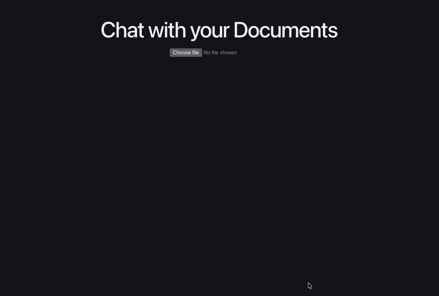
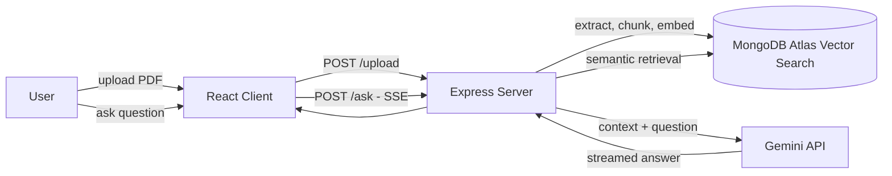

# RAG Document Q&A — Chat with your Documents

Upload a PDF and ask questions about it. Answers are generated **only from the document's content**, streamed token-by-token, with **source citations** showing exactly which passages the answer came from.



## How it works



1. **Ingestion** — PDF text is extracted (unpdf), split into overlapping chunks, embedded with Gemini (`gemini-embedding-001`, 768 dims), and stored in MongoDB Atlas with a vector index.
2. **Retrieval** — the question is embedded with the same model and the most relevant chunks are found via `$vectorSearch`, filtered by document.
3. **Generation** — retrieved chunks are injected into the prompt; Gemini answers strictly from that context and cites the passages used. Off-document questions get "I couldn't find that in the document" instead of a hallucination.
4. **Streaming** — answers stream to the React UI over Server-Sent Events.

## Stack

Node.js · Express · React (Vite) · MongoDB Atlas Vector Search · Gemini API · unpdf

## Run locally

### Server

```bash
cd server
npm install
node server.js
```

Create `server/.env`:

```
GEMINI_API_KEY=your_key
MONGODB_URI=your_atlas_uri
```

### Client

```bash
cd client
npm install
npm run dev
```

### MongoDB Atlas setup

Requires a vector search index named `vector_index` on the `ragdb.docs` collection:

```json
{
  "fields": [
    {
      "type": "vector",
      "path": "embedding",
      "numDimensions": 768,
      "similarity": "cosine"
    },
    {
      "type": "filter",
      "path": "docId"
    }
  ]
}
```
